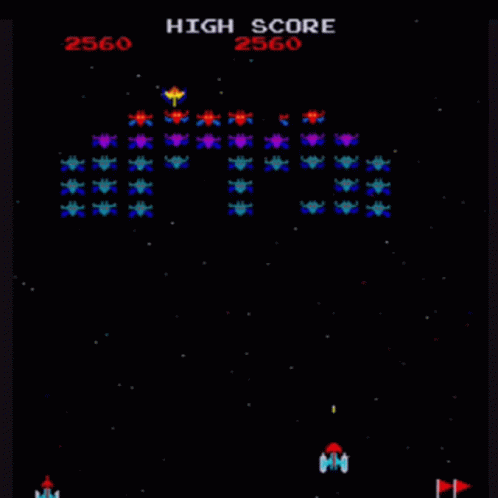

<h1 align="center">Hey there 👋 I'm Thilina</h1>

  

  🎮 <strong>Game Developer</strong> | 🧠 <strong>Programmer</strong> | 🎧 <strong>Music Lover</strong> 
  🕹️ <em>"I Make Games. Sometimes They Work."</em>

---

### 🚀 About Me

- 🧩 I love building **games**, especially with **Unity**  
- 🔥 Passionate about **Pokémon**, retro games & anything RPG  
- 🎶 Catch me coding while vibing to some lo-fi beats  
- 💻 Currently using: **C#**, **Python**, **C++**, and **Java**

---

### 🛠️ Tech Stack

---

### 📈 GitHub Stats

  

---

### 🎯 Fun Fact
> I probably have a folder of unfinished game projects older than your save file 🗃️🐉

---

### 📫 Let's Connect

---

🧙 Thanks for stopping by! May your code compile and your loot drops be legendary!

